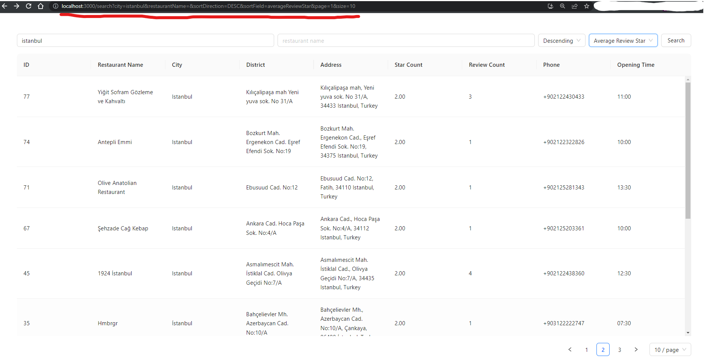
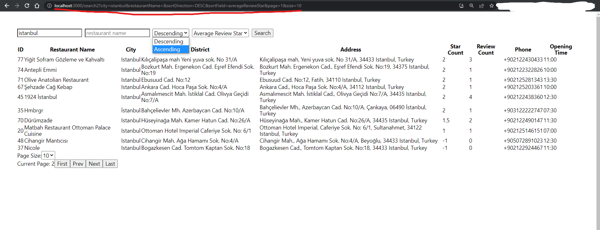

# React Pagination, Filtering, and Sorting with URL Sync

### This example provides pagination, filtering, and sorting functionality. The UI is synchronized with the URL. When you change any input and send a search request URL will update. Additionally, if you copy the link and paste it in the browser, the component will retrieve the response with the same parameters as before. 

---------------

## How to Use?

- just connect to your api and set your fields, params etc.
- you can use **data.json** for trying

```
localhost:3000/search?city=istanbul&restaurantName=&sortDirection=DESC&sortField=reviewsCount&page=8&size=10 // example

/search         //using antdesign 
/search2        //without ui library 
```
##

## Example with AntDesign Components


## Example with Simple Html Components

